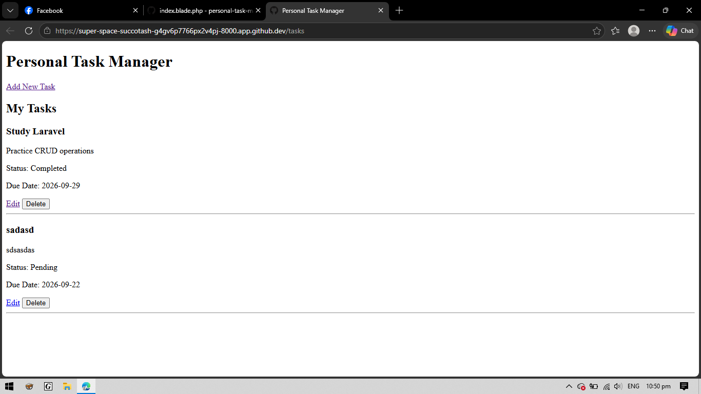
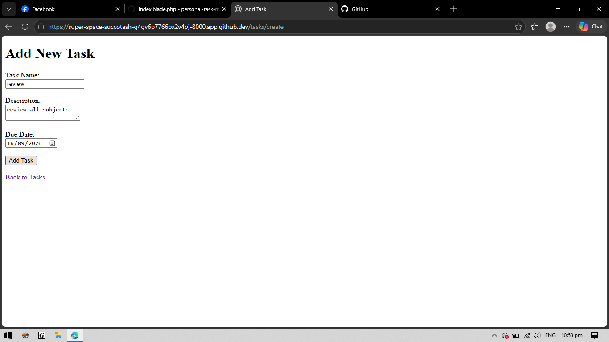
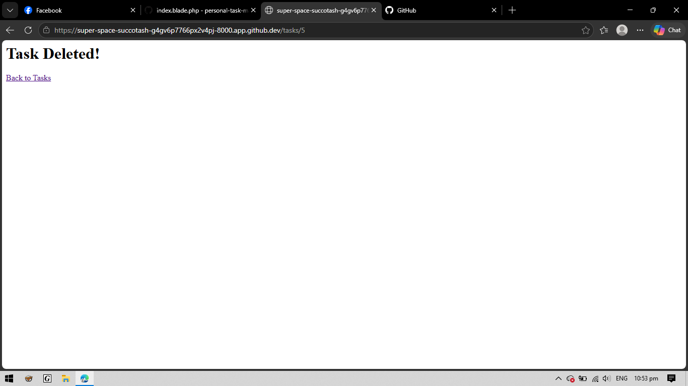
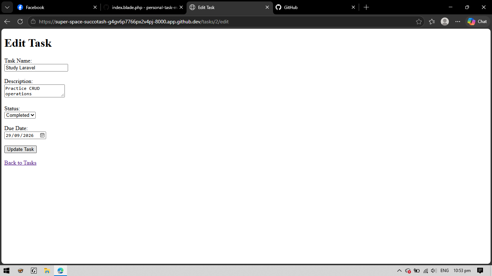
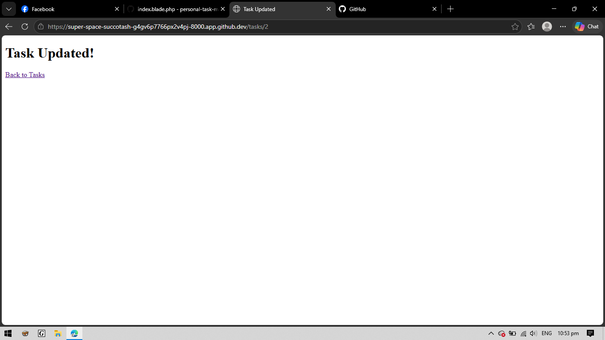

# Personal Task Manager

## Description

The Personal Task Manager is a Laravel web application for managing personal tasks.

The application allows users to add, view, edit, update, delete, and change the status of tasks.

## Features

- Add a new task
- View all tasks
- Edit a task
- Update task information
- Delete a task
- Change task status
- Set a due date
- Add a task description

## Task Information

Each task contains:

- Task Name
- Description
- Status
- Due Date

Available statuses:

- Pending
- Completed

## Technologies Used

- Laravel
- PHP
- SQLite
- Blade
- HTML
- GitHub Codespaces

## How the System Works

The application follows the basic Laravel flow:

**Route → Controller → Model/Database → View → Browser**

### 1. Route

The routes are defined in:

```text
routes/web.php
```

The routes receive the user's request and decide which controller function should handle it.

For example:

```php
Route::get('/tasks', [TaskController::class, 'index']);
```

This means that when the user visits `/tasks`, Laravel calls the `index()` function in the `TaskController`.

### 2. Controller

The controller is located at:

```text
app/Http/Controllers/TaskController.php
```

The controller handles the application's actions.

For example, the `index()` function gets all tasks from the database:

```php
public function index()
{
    $tasks = Task::all();

    return view('tasks.index', compact('tasks'));
}
```

The controller then sends the task data to the Blade view.

### 3. Model and Database

The model is located at:

```text
app/Models/Task.php
```

The `Task` model represents the tasks stored in the database.

The application uses SQLite as its database.

The tasks table contains:

- ID
- Task Name
- Description
- Status
- Due Date
- Created At
- Updated At

The controller uses the model to create, retrieve, update, and delete tasks.

### 4. View

The views are created using Laravel Blade.

They are located at:

```text
resources/views/tasks/
```

The main views are:

```text
index.blade.php
create.blade.php
edit.blade.php
updated.blade.php
```

The Blade views display the task information to the user and provide forms for adding, editing, and deleting tasks.

### 5. Browser

After Laravel processes the request, the Blade view is displayed in the browser.

The basic system flow is:

```text
User
  ↓
Browser
  ↓
Route
  ↓
TaskController
  ↓
Task Model
  ↓
Database
  ↓
TaskController
  ↓
Blade View
  ↓
Browser
```

## Project Structure

```text
personal-task-manager/
│
├── app/
│   ├── Http/
│   │   └── Controllers/
│   │       └── TaskController.php
│   │
│   └── Models/
│       └── Task.php
│
├── database/
│   ├── factories/
│   ├── migrations/
│   │   └── 2026_09_25_154112_create_tasks_table.php
│   └── seeders/
│
├── resources/
│   └── views/
│       └── tasks/
│           ├── index.blade.php
│           ├── create.blade.php
│           ├── edit.blade.php
│           └── updated.blade.php
│
├── routes/
│   └── web.php
│
├── public/
│   └── index.php
│
├── screenshots/
│   ├── add-task.png
│   ├── delete-task.png
│   ├── edit-task.png
│   ├── task-list.png
│   └── task-updated.png
│
├── .env.example
├── artisan
├── composer.json
└── README.md
```

## Screenshots

### Task List

This screenshot shows the Personal Task Manager with the list of tasks, task status, due date, Edit button, and Delete button.



### Add New Task

This screenshot shows the form for adding a new task.



### Delete Task

This screenshot shows the confirmation page after deleting a task.



### Edit Task

This screenshot shows the Edit Task form where the task information can be changed.



### Task Updated

This screenshot shows the confirmation page after successfully updating a task.



## How to Run

### 1. Open the Project

Open the project in GitHub Codespaces.

### 2. Install Dependencies

Run:

```bash
composer install
```

### 3. Create the Environment File

Run:

```bash
cp .env.example .env
```

### 4. Generate the Application Key

Run:

```bash
php artisan key:generate
```

### 5. Run Database Migration

Run:

```bash
php artisan migrate
```

### 6. Start the Laravel Server

Run:

```bash
php artisan serve --host=0.0.0.0 --port=8000
```

### 7. Open the Application

Open port `8000` from the GitHub Codespaces **Ports** tab and open the application in the browser.

## Task Management

The application supports the following task operations:

### Add Task

Users can enter:

- Task Name
- Description
- Due Date

New tasks are automatically given the status:

```text
Pending
```

### View Tasks

The task list displays all saved tasks along with their:

- Task Name
- Description
- Status
- Due Date

### Edit Task

Users can edit the task name, description, status, and due date.

### Delete Task

Users can delete a task from the task list using the Delete button.

### Change Status

Users can change a task status between:

```text
Pending
Completed
```

## Laravel Components Used

### Route

Routes are defined in:

```text
routes/web.php
```

### Controller

The main controller is:

```text
app/Http/Controllers/TaskController.php
```

### Model

The model is:

```text
app/Models/Task.php
```

### Migration

The database table is created using:

```text
database/migrations/2026_09_25_154112_create_tasks_table.php
```

### Blade Views

The application uses Laravel Blade views located in:

```text
resources/views/tasks/
```

## Author

**Ryan G. Sapanta**

BSIT - 2